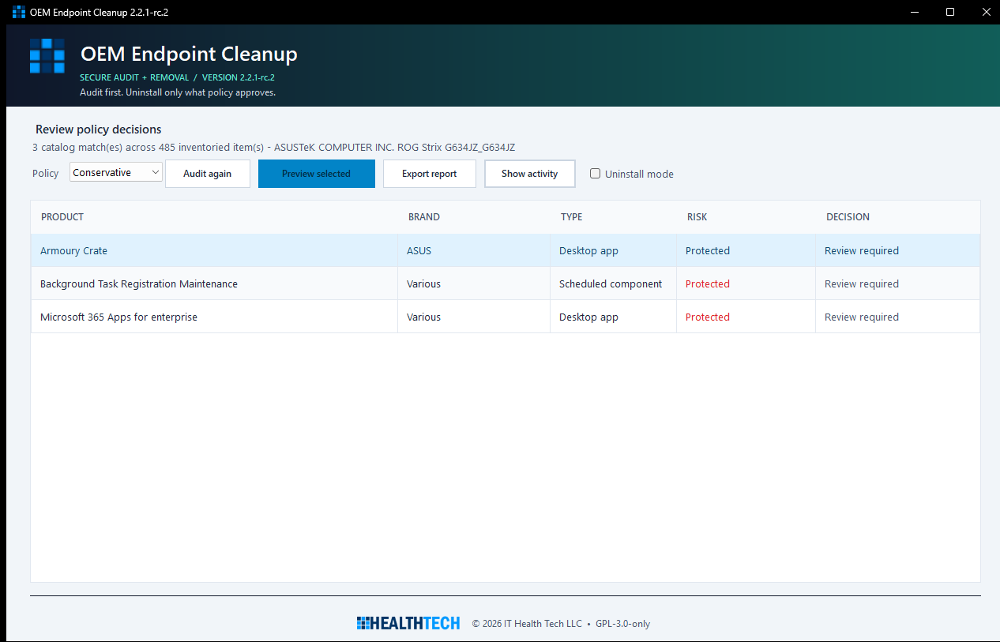

# OEM Endpoint Cleanup

A security-focused Windows utility for inventorying, auditing, and optionally removing OEM bloatware and bundled antivirus trials. Version 2.2 defaults to dry-run, evaluates every item through policy, validates uninstall commands without a shell, and generates MSP/RMM-friendly evidence.


## Application preview



The preview is generated before inventory begins and contains no hostname, serial number, installed-software inventory, or customer/device data.

## OEM and software coverage

The embedded catalog includes Dell, Alienware, HP, ASUS, Acer, Lenovo, MSI, Samsung, Toshiba/Dynabook, Microsoft Surface, LG, Gigabyte, Razer, and Fujitsu. It also recognizes common:

- Antivirus and browser-security trials
- Support assistants and OEM update managers
- Registration, warranty, welcome, and promotional utilities
- Telemetry and customer-experience agents
- Consumer games, cloud-storage promotions, and selected AppX packages
- OEM services and scheduled tasks for audit/manual review

Hardware-control suites, hotkeys, recovery tools, BIOS/firmware dependencies, drivers, audio/network/chipset components, RMM agents, remote-access tools, VPN clients, BitLocker tooling, and backup agents are preserved by policy.

## Safe usage

1. Start `PreloadedAVRemover.exe` and approve UAC.
2. Review the automatic audit. JSON and HTML reports are written immediately.
3. Select a policy profile and one or more rows whose decision is **Remove**.
4. Leave **Uninstall mode** unchecked and choose **Preview selected** to validate the plan without changing the device.
5. To make changes, enable **Uninstall mode**, choose **Uninstall selected**, and approve the confirmation dialog.
6. Review the post-execution inventory, results, exit codes, and reboot indicators in the exported report.

The main grid uses friendly product and status labels. Hover over a product name to see its exact technical name and identifier; exported audit reports always retain the original values.

Endpoint protection remains audit-only unless **Include security apps** is explicitly enabled in uninstall mode. Enabling it does not override allowlists, protected-software safeguards, manual-review catalog entries, or command validation.

## Policy profiles

| Profile | Automatic eligibility |
| --- | --- |
| `Conservative` | Catalog entries marked `safe` only |
| `Balanced` | `safe` and cataloged `caution` entries, with confirmation |
| `Aggressive` | `safe` and `caution`; `manual-review` remains protected |

The default profile is `Conservative`, and dry-run is enabled by default.

## Organization policy configuration

Copy [`policy.example.json`](policy.example.json) to:

```text
C:\ProgramData\OemCleanup\policy.json
```

Example:

```json
{
  "profile": "Conservative",
  "dryRun": true,
  "force": false,
  "allowSecurityProductRemoval": false,
  "processTimeoutSeconds": 900,
  "allowList": ["Lenovo Vantage", "*SupportAssist*"],
  "blockList": ["WildTangent Games"],
  "reportDirectory": "C:\\ProgramData\\OemCleanup\\Reports"
}
```

Wildcards `*` and `?` are supported. The allowlist wins over the blocklist. A blocklist can promote a cataloged caution item to removal eligibility, but it cannot bypass protected-software patterns, endpoint-protection authorization, manual-review classification, or an unsupported removal backend.

`force: true` suppresses the final UI confirmation for an already policy-authorized action. Use it only with centrally managed, access-controlled configuration deployment. Malformed policy files fail closed to conservative dry-run behavior.

`processTimeoutSeconds` bounds each validated uninstaller to 30–3600 seconds (default 900). A timeout terminates the process tree where Windows permits and is reported separately from an installer failure.

## Inventory and audit output

Reports are written to `C:\ProgramData\OemCleanup\Reports` unless policy specifies another directory:

- `*.json`: machine-readable schema for RMM/MSP ingestion
- `*.html`: human-readable device, inventory, decision, and execution report
- `*.jsonl`: hash-chained audit events
- `*-execution.jsonl`: commands, results, errors, exit codes, reboot flags, and post-execution inventory

Reports include hostname, user context, local-admin status, Windows version, manufacturer, model, BIOS version, serial number, reboot-pending state, Security Center AV inventory, full installed-app inventory, catalog matches, match confidence and evidence, risk and policy decisions, before/after counts, timeout/failure results, and rollback guidance. Each JSONL event contains its previous-event hash; whole-log SHA-256 checksums are recorded in the report.

## Removal and command safety

- Registry uninstall strings are parsed with `CommandLineToArgvW` and executed as a direct executable plus argument vector—never through `cmd.exe`.
- Executable paths must be absolute, end in `.exe`, and exist.
- Environment-expanded and network-hosted registry executable paths are rejected.
- Shells and script hosts from registry commands are rejected.
- MSI removal is rebuilt as `msiexec /x {ProductCode} /qn /norestart` from a validated GUID.
- AppX and winget use fixed handlers with validated package identifiers. AppX removal passes the package name as a separate script-block argument and uses Windows' all-users package-removal API.
- Captured uninstaller output is included in failed results so reports show the vendor or Windows deployment error instead of only an exit code.
- Services, scheduled tasks, and registry artifacts are detected and audited but fail closed unless a dedicated catalog handler is implemented.
- No arbitrary file or registry deletion is performed.
- Non-admin removal attempts fail without starting a process.
- Catalog duplicates, malformed regular expressions, low-confidence matches, and equally scored ambiguous matches fail closed.
- Active Security Center products require explicit security-removal authorization even if catalog metadata is incomplete.

## Rollback

Vendor uninstallers are not transactional. For successfully removed software, reinstall from the OEM support portal, Microsoft Store, or the organization's approved package source. The report records item-specific reinstall guidance. The utility does not create restore points or attempt unsafe file/registry reconstruction.

## Build

Install the [.NET 8 SDK](https://dotnet.microsoft.com/download/dotnet/8.0), then run:

```powershell
dotnet publish .\PreloadedAVRemover.csproj `
  -c Release `
  -r win-x64 `
  --self-contained true `
  -p:PublishSingleFile=true `
  -p:IncludeNativeLibrariesForSelfExtract=true `
  -o .\publish
```

### Installer package

The branded setup launcher offers three modes:

- **Everyone on this computer** — installs the MSI per-machine under Program Files and requests administrator approval through Windows Installer.
- **Just me** — installs the same dual-purpose MSI per-user under Local AppData without registering it for other Windows users.
- **Portable** — verifies and extracts the portable ZIP to a selected folder without Windows Installer registration or shortcuts.

Build all three artifacts with:

```powershell
.\installer\Build-Installer.ps1 -Configuration Release
```

Outputs are written to `publish-installer\artifacts` with a `SHA256SUMS.txt` manifest. The launcher validates the adjacent MSI and portable ZIP against SHA-256 values embedded at build time before installing or extracting them.

For unattended MSI deployment, use standard Windows Installer properties:

```powershell
# All users (elevated)
msiexec.exe /i .\OEM-Endpoint-Cleanup-2.2.1-rc.2-win-x64.msi /qn /norestart ALLUSERS=1 MSIINSTALLPERUSER=""

# Current user
msiexec.exe /i .\OEM-Endpoint-Cleanup-2.2.1-rc.2-win-x64.msi /qn /norestart ALLUSERS=2 MSIINSTALLPERUSER=1
```

The MSI is built with WiX Toolset 5.0.2. WiX v6 introduced a separate Open Source Maintenance Fee; version 5.0.2 is intentionally pinned for this GPL project pending an organizational licensing decision for newer WiX releases.

## Tests

```powershell
dotnet test .\tests\PreloadedAVRemover.Tests\PreloadedAVRemover.Tests.csproj -c Release
```

See [`TEST_REPORT.md`](TEST_REPORT.md) for coverage, results, and remaining risks, and [`ARCHITECTURE.md`](ARCHITECTURE.md) for the integration design.

The GitHub Actions CI workflow runs formatting verification, a Release build, all tests, the non-elevated layout-only UI self-test, a self-contained single-file publish verification, and a complete MSI/launcher/portable packaging build. It does not create a release or deploy artifacts.

## License

OEM Endpoint Cleanup is licensed under the [GNU General Public License v3.0](LICENSE). The project metadata uses the `GPL-3.0-only` SPDX expression.

Copyright © 2026 IT Health Tech LLC. See [`NOTICE`](NOTICE) for the copyright notice and [`LICENSE`](LICENSE) for the license terms.
