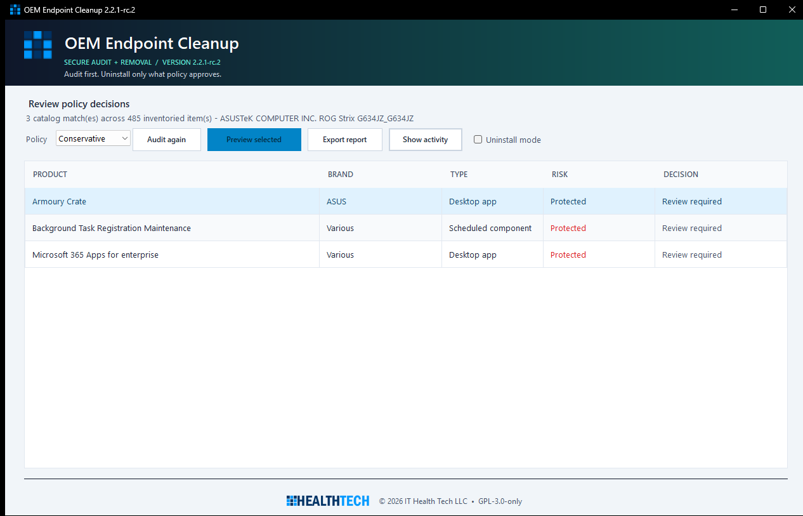

<div align="center">

# OEM Endpoint Cleanup

**Audit-first removal of OEM bloatware and bundled antivirus trials, for Windows fleets.**

It inventories what is on the machine, scores every match with evidence, evaluates each
one against policy, and writes tamper-evident reports — in dry-run by default.

[](#requirements)
[](#requirements)
[](https://github.com/ithealthtech/PreloadedAVRemover/releases/latest)
[](LICENSE)

[**Documentation site**](https://ithealthtech.github.io/PreloadedAVRemover/) ·
[Download](https://github.com/ithealthtech/PreloadedAVRemover/releases/latest) ·
[Operator guide](docs/operator-guide.md) ·
[Security model](docs/security-model.md)

</div>

---

## Why this exists

Removing preloaded junk from a new machine is easy to do badly. A script that matches on
a name and shells out to whatever the registry says will eventually uninstall a VPN
client, a backup agent, or the RMM you need to reach the device.

This tool is built around the opposite default: **it refuses to act unless it can prove
the action is safe.** A catalog match alone never executes anything. Policy, backend
support, elevation, and command validation must all pass first — and every decision it
makes is written to a report you can hand to a client.

## What you get

- **An audit before anything else.** Every run starts read-only and writes JSON and HTML
  reports immediately.
- **Evidence-scored matching.** Matches carry a 0–100 confidence score and readable
  rationale. Low-confidence and tied candidates fail closed to manual review.
- **Protected software that stays protected.** RMM, remote access, VPN, backup,
  encryption, drivers, and firmware are guarded *before* your blocklist is applied, so a
  wildcard can never reach them.
- **No shell, ever.** Registry uninstall strings are parsed and executed as a direct
  executable plus argument vector — never through `cmd.exe`.
- **Defensible records.** Hash-chained JSONL audit events plus RMM-ingestible JSON.



<sub>The preview is generated before inventory begins and contains no hostname, serial
number, installed-software inventory, or customer device data.</sub>

## Install

Download the [latest release](https://github.com/ithealthtech/PreloadedAVRemover/releases/latest).
The setup launcher offers **Everyone on this computer**, **Just me**, and **Portable**
modes. An MSI and a portable ZIP are also published separately, with a `SHA256SUMS.txt`
manifest.

```powershell
# Verify before deploying
Get-FileHash .\OEM-Endpoint-Cleanup-2.2.1-win-x64.msi -Algorithm SHA256
```

> [!NOTE]
> The published executable is not code-signed and may trigger SmartScreen. For production
> distribution, re-sign with an organization-controlled certificate.

### Requirements

Windows x64. The application is published self-contained, so no .NET runtime install is
required on the endpoint. Elevation is needed to read the full inventory.

## Quick start

1. Launch and approve UAC.
2. Review the automatic audit — reports are already written at this point.
3. Select rows whose decision is **Remove**.
4. With **Uninstall mode** off, choose **Preview selected** to validate the plan.
5. To make changes, enable **Uninstall mode**, choose **Uninstall selected**, and confirm.

Steps 1–4 change nothing. See the [operator guide](docs/operator-guide.md) for reading the
grid, the two authorization gates, and what to do when an item will not remove.

## Safety model in one table

| Control | Default | Notes |
| --- | --- | --- |
| Dry-run | **On** | No process is started at all |
| Policy profile | **Conservative** | `Safe` catalog entries only |
| Endpoint protection removal | **Off** | Requires the separate *Include security apps* gate |
| Remote-tool removal | **Off** | Requires the separate *Include remote tools* gate |
| ConnectWise / ScreenConnect | **Always preserved** | No setting promotes them to removal |
| Services, tasks, registry artifacts | **Audit only** | Fail closed without a dedicated tested handler |

Full detail in [docs/security-model.md](docs/security-model.md).

## Coverage

The embedded catalog holds 82 entries spanning Dell, Alienware, HP, ASUS, Acer, Lenovo,
MSI, Samsung, Toshiba/Dynabook, Microsoft Surface, LG, Gigabyte, Razer, and Fujitsu, plus
antivirus and browser-security trials, support assistants, update managers, registration
and warranty utilities, telemetry agents, consumer games, cloud-storage promotions, and
selected AppX packages.

Hardware-control suites, hotkeys, recovery tools, BIOS/firmware dependencies, drivers,
audio/network/chipset components, and management agents are preserved by policy.

See [docs/catalog.md](docs/catalog.md) for the entry format and how to request coverage.

## Configuration

Organization policy is optional; without it the tool runs conservative and dry-run. To
manage it centrally, copy [`policy.example.json`](policy.example.json) to
`C:\ProgramData\OemCleanup\policy.json`. A malformed file fails closed rather than being
partially applied.

Full schema in [docs/configuration.md](docs/configuration.md); RMM rollout guidance in
[docs/deployment.md](docs/deployment.md).

## Build and test

```powershell
dotnet build .\PreloadedAVRemover.csproj
dotnet test .\tests\PreloadedAVRemover.Tests\PreloadedAVRemover.Tests.csproj -c Release
```

There is no solution file — build each sub-project individually. See
[docs/building.md](docs/building.md) for the self-contained publish and installer
packaging, and [docs/testing.md](docs/testing.md) for what the suite covers.

## Documentation

| For operators | For developers |
| --- | --- |
| [Operator guide](docs/operator-guide.md) | [Architecture](docs/architecture.md) |
| [Configuration](docs/configuration.md) | [Security model](docs/security-model.md) |
| [Reports and auditing](docs/reports.md) | [Catalog](docs/catalog.md) |
| [Deployment](docs/deployment.md) | [Building](docs/building.md) · [Testing](docs/testing.md) |

The end-user site is published at
<https://ithealthtech.github.io/PreloadedAVRemover/>.

## Contributing

See [CONTRIBUTING.md](CONTRIBUTING.md). Catalog requests can be filed as an issue without
writing any code. Security defects go through [SECURITY.md](SECURITY.md) — never a public
issue.

## License

Licensed under the [GNU General Public License v3.0](LICENSE) (`GPL-3.0-only`).

Copyright © 2026 IT Health Tech LLC. See [NOTICE](NOTICE).
